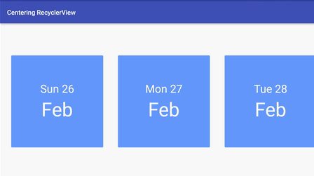

# SnappyRecyclerView

An extension to RecyclerView which will snap to child Views to the specified anchor, START, CENTER or END.

<br/>


## Setup

#### Gradle

`compile 'com.github.dan-td:snappy-recyclerview:1.0.0'`

#### Maven
```
<dependency>
    <groupId>com.github.dan-td</groupId>
    <artifactId>snappy-recyclerview</artifactId>
    <version>1.0.0</version>
    </dependency>
```

## Sample Usage

```xml
    <com.dant.centersnapreyclerview.SnappingRecyclerView
        android:layout_width="wrap_content"
        android:layout_height="wrap_content"
        app:orientation="horizontal"
        app:anchor="center" />
```

### XML Attributes

* **orientation** - the orientation of the recyclerview, VERTICAL or HORIZONTAL
* **anchor** - the snap anchor of the recyclerview, START, CENTER or END
* **scrollSpeed** - the smooth scroll speed
* **flingThreshold** - the threshold above which a fling is will occur

## License

```
Copyright 2017 Daniel Tanner-Davies

Permission is hereby granted, free of charge, to any person obtaining a copy of this software and associated documentation files (the "Software"), to deal in the Software without restriction, including without limitation the rights to use, copy, modify, merge, publish, distribute, sublicense, and/or sell copies of the Software, and to permit persons to whom the Software is furnished to do so, subject to the following conditions:

The above copyright notice and this permission notice shall be included in all copies or substantial portions of the Software.

THE SOFTWARE IS PROVIDED "AS IS", WITHOUT WARRANTY OF ANY KIND, EXPRESS OR IMPLIED, INCLUDING BUT NOT LIMITED TO THE WARRANTIES OF MERCHANTABILITY, FITNESS FOR A PARTICULAR PURPOSE AND NONINFRINGEMENT. IN NO EVENT SHALL THE AUTHORS OR COPYRIGHT HOLDERS BE LIABLE FOR ANY CLAIM, DAMAGES OR OTHER LIABILITY, WHETHER IN AN ACTION OF CONTRACT, TORT OR OTHERWISE, ARISING FROM, OUT OF OR IN CONNECTION WITH THE SOFTWARE OR THE USE OR OTHER DEALINGS IN THE SOFTWARE.
```
